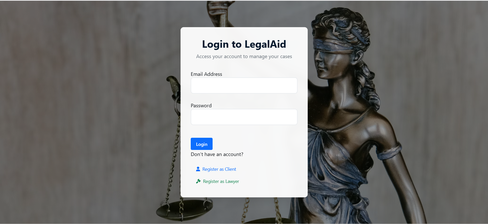

# Legal Aid Management System (MERN)

## Overview

The Legal Aid Management System is a full-stack web application developed to manage legal cases, client information, and case records efficiently. This system helps legal staff maintain digital records and perform case management operations.
## 📸 Application Screenshots

### 🏠 Home & Authentication
| Home Page | Login |
|-------|-----------|
|  |  |

### 📊 Dashboard & Navigation
| Client Dashboard | Footer |
|------------------|--------|
|  |  |

### ⚖️ Case Management
| Case Filing Form | Case Details + Chat |
|------------------|---------------------|
|  |  |

### 💬 Communication
| Chat Assistance | Interactive Map |
|-----------------|-----------------|
|  |  |

### 📄 Document Tools
| Generate Legal Docs | Manage Docs Section | Legal Docs Templates |
|---------------------|---------------------|----------------------|
|  |  |  |

### 📑 PDF & Checklist
| Download Case PDF | Pre Court Checklist |
|-------------------|---------------------|
|  | .png) |

## Technologies Used

* MongoDB
* Express.js
* React.js
* Node.js
* JavaScript
* HTML & CSS

## Features

* User authentication
* Case management (Create, Read, Update, Delete)
* Client record management
* Dashboard view
* REST API integration

## My Contributions

* Developed React frontend interfaces for:
  - Home pages and legal education hub sections
  - Client case filing and legal document management systems
  - Lawyer rating system, court preparation, and legal document generation modules
* Implemented backend REST APIs using Node.js and Express
* Designed and optimized MongoDB database schemas
* Integrated frontend components with backend APIs
* Implemented comprehensive CRUD functionality across the application

## Project Structure

/frontend – React application
/Backend – Node.js server
/screenshots – Application images
/docs – Database and project documents

## Demo Video
https://drive.google.com/drive/folders/1AwDtS39vbI99wizBHtSjedM7qpRv3ZE9?usp=sharing

## How to Run Locally

### Backend

cd Backend
npm install
npm start

### Frontend

cd frontend
npm install
npm start

Open in browser:
http://localhost:3000

## Note

**This project was developed as a university group assignmentby 4 members including me.**

